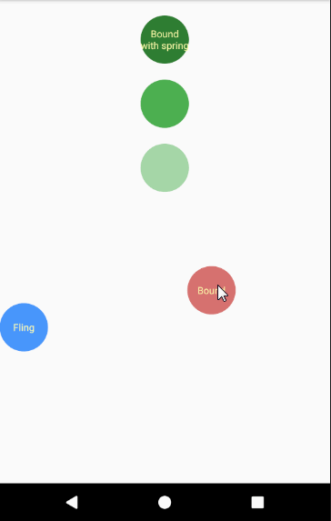

# 基于Android物理动画的越界回弹动画 #

ps:图片有点掉帧

## 物理动画库真的很“物理”吗？ ##
Android的物理动画库（support-dynamic-animation）库已经出来了很长一段时间了。用过的人肯定知道FlingAnimation这个动画是可以设置最大值和最小值的。

我们来看看设置最大值和最小值（手机屏幕个边界）后的FlingAnimation动画。

</img>

咦！好像有哪里不对劲！！！

</img>

当值到达最大值或者最小值的时候速度直接归0了。这不是我想要的物理体验啊

## 找原因~ ##

辛好FlingAnimation.java这个类的源码不多。那我们来慢慢找寻原因所在地...</img>

功夫不负有心人啊！很快找到了造成这个不物理现象的原因所在地updateValueAndVelocity(long deltaT)方法（ps：return true 就表示动画结束）

    @Override
    boolean updateValueAndVelocity(long deltaT) {

        MassState state = mFlingForce.updateValueAndVelocity(mValue, mVelocity, deltaT);
        mValue = state.mValue;
        mVelocity = state.mVelocity;

        // When the animation hits the max/min value, consider animation done.
        if (mValue < mMinValue) {
            mValue = mMinValue;
            return true;
        }
        if (mValue > mMaxValue) {
            mValue = mMaxValue;
            return true;
        }

        if (isAtEquilibrium(mValue, mVelocity)) {
            return true;
        }
        return false;
    }

`isAtEquilibrium(float value, float velocity)`:

    @Override
    boolean isAtEquilibrium(float value, float velocity) {
        return value >= mMaxValue
                || value <= mMinValue
                || mFlingForce.isAtEquilibrium(value, velocity);
    }

`mFlingForce.isAtEquilibrium(float value, float velocity)`： 

        @Override
        public boolean isAtEquilibrium(float value, float velocity) {
            return Math.abs(velocity) < mVelocityThreshold;
        }

可见当最新的值小于最小值或者大于最大值时直接置为对应的阈值并且动画强制结束。而正常的动画结束应该是速度的绝对值小于速度的阈值。

</img>

## 动手修改 ##
大家都应该还记得读书时候学到的力的碰撞相关的知识（理想的碰撞）

</img>

如图所示一个理想的斜碰撞可以拆分为竖直方向和横向的正碰撞，发生了碰撞的速度就方向相反、大小不变。已经越界的距离要相应的变为离边界的正距离。

    @Override
    boolean updateValueAndVelocity(long deltaT) {
        MassState state = mFlingForce.updateValueAndVelocity(mValue, mVelocity, deltaT);
        mValue = state.mValue;
        mVelocity = state.mVelocity;

        if (mValue < mMinValue) {
            mValue = 2 * mMinValue - mValue;
            mVelocity = -mVelocity;
        } else if (mValue > mMaxValue) {
            mValue = 2 * mMaxValue - mValue;
            mVelocity = -mVelocity;
        }

        return isAtEquilibrium(mValue, mVelocity);
    }

修改后的结果如下图：

</img> </img>

虽然也不是很"物理"但是至少有点物理了~
</img>

## 在理想一点 摩擦力为0##
这个原先的FlingAnimation是不支持的：

    public FlingAnimation setFriction(
            @FloatRange(from = 0.0, fromInclusive = false) float friction) {
        if (friction <= 0) {
            throw new IllegalArgumentException("Friction must be positive");
        }
        mFlingForce.setFrictionScalar(friction);
        return this;
    }

可见当设置为0时 会直接抛出错误</img>而且在更新最新的值和速度时也会出现分母为0的错误：

        MassState updateValueAndVelocity(float value, float velocity, long deltaT) {
            mMassState.mVelocity = (float) (velocity * Math.exp((deltaT / 1000f) * mFriction));
            mMassState.mValue = (float) (value - velocity / mFriction
                    + velocity / mFriction * Math.exp(mFriction * deltaT / 1000f));
            if (isAtEquilibrium(mMassState.mValue, mMassState.mVelocity)) {
                mMassState.mVelocity = 0f;
            }
            return mMassState;
        }

### 哼！我就是要摩擦力为0 ###

大家应该都知道摩擦力为0，那就意味着永动、能量不损失、速度不降低（省下好多计算）。

那就来修改吧：

#### setFriction(float friction) ####

    public FlingBoundAnimation setFriction(@FloatRange(from = 0.0) float friction) {
        if (friction < 0) {
            throw new IllegalArgumentException("Friction must be positive");
        }
        mFlingForce.setFrictionScalar(friction);
        return this;
    }

#### updateValueAndVelocity(float value, float velocity, long deltaT) ####

        MassState updateValueAndVelocity(float value, float velocity, long deltaT) {
            if (mFriction != 0) {
                mMassState.mVelocity = (float) (velocity * Math.exp((deltaT / 1000f) * mFriction));
                mMassState.mValue = (float) (value - velocity / mFriction
                        + velocity / mFriction * Math.exp(mFriction * deltaT / 1000f));
                if (isAtEquilibrium(mMassState.mValue, mMassState.mVelocity)) {
                    mMassState.mVelocity = 0f;
                }
            } else {
                mMassState.mVelocity = velocity;
                mMassState.mValue = value + velocity * (deltaT / 1000f);
            }
            return mMassState;
        }

#### updateValueAndVelocity(long deltaT) ####

    @Override
    boolean updateValueAndVelocity(long deltaT) {
        MassState state = mFlingForce.updateValueAndVelocity(mValue, mVelocity, deltaT);
        mValue = state.mValue;
        mVelocity = state.mVelocity;

        if (mValue < mMinValue) {
            mValue = 2 * mMinValue - mValue;
            mVelocity = -mVelocity;
        } else if (mValue > mMaxValue) {
            mValue = 2 * mMaxValue - mValue;
            mVelocity = -mVelocity;
        }

        return mFlingForce.mFriction != 0 && isAtEquilibrium(mValue, mVelocity);
    }

结果如下：

</img>

## 修改大成功 ##

这次修改其实发现只要自己实现`updateValueAndVelocity(long deltaT)`这个方法中自己实现相关的计算就可以实现自己想要的效果~

</img>